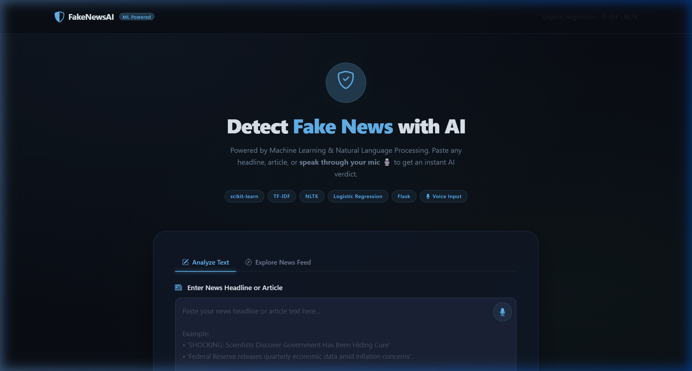
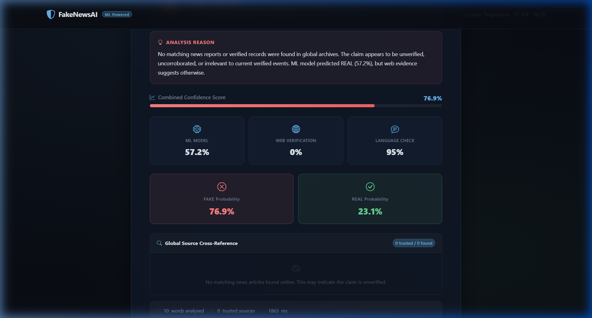
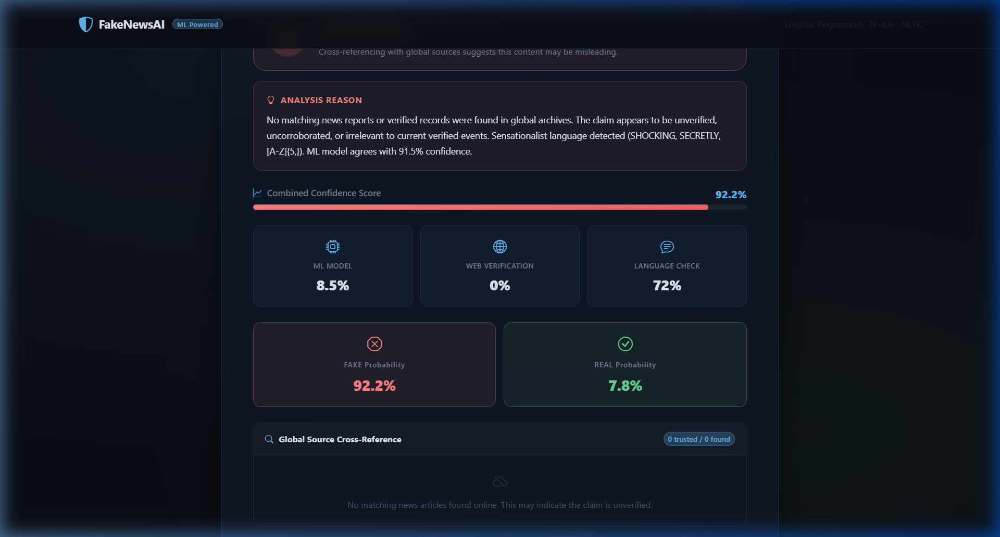

<div align="center">

# 🛡️ Fake News Detector

### _Don't believe everything you read. Verify it._

[](https://python.org)
[](https://flask.palletsprojects.com)
[](https://scikit-learn.org)
[](https://getbootstrap.com)
[](LICENSE)

<br>

An AI-powered web application that detects fake news using **Machine Learning** + **Real-Time Multi-Source Verification**. It doesn't just predict — it _cross-references your news against 80+ trusted global sources_ including Reuters, BBC, AP News, NDTV, and more.

<br>

**[🚀 Live Demo](#-quick-start)** · **[📖 How It Works](#-how-it-works)** · **[⚙️ Setup](#️-installation--setup)** · **[🧠 Architecture](#-architecture)**

---

</div>

<br>

## 📸 Screenshots

<div align="center">

### 🏠 Homepage — Dark Theme Interface


<br><br>

### ✅ Real News Detection — Verified Result


<br><br>

### ❌ Fake News Detection — Flagged as Unverified


</div>

<br>

## ✨ What Makes This Different?


Most fake news detectors just use an ML model and call it a day. **This one goes further:**

| Feature | Basic Detectors | 🛡️ This Project |
|---------|:-:|:-:|
| ML Model Prediction | ✅ | ✅ |
| Real-time news cross-referencing | ❌ | ✅ |
| Multi-source parallel search (NewsAPI + GNews + Bing) | ❌ | ✅ |
| 80+ trusted source verification | ❌ | ✅ |
| Sensationalist language detection | ❌ | ✅ |
| Fact-checker site matching | ❌ | ✅ |
| Hindi / multilingual support | ❌ | ✅ |
| Dark theme UI with live animations | ❌ | ✅ |
| Prediction history tracking | ❌ | ✅ |

<br>

## 🔍 How It Works

```
┌─────────────────────────────────────────────────────────────────────┐
│                        USER SUBMITS NEWS                            │
└──────────────────────────────┬──────────────────────────────────────┘
                               │
                               ▼
              ┌────────────────────────────────┐
              │   🌐 Language Detection        │
              │   Hindi → Auto-translate       │
              └────────────────┬───────────────┘
                               │
                ┌──────────────┼──────────────┐
                ▼              ▼              ▼
     ┌──────────────┐ ┌──────────────┐ ┌──────────────┐
     │ 🤖 ML Model  │ │ 🌍 Web Search│ │ 📝 Language  │
     │  (TF-IDF +   │ │  (3 Sources  │ │  Analysis    │
     │  Logistic     │ │  in Parallel)│ │  (Clickbait  │
     │  Regression)  │ │              │ │   Patterns)  │
     └──────┬───────┘ └──────┬───────┘ └──────┬───────┘
            │                │                │
            └────────────────┼────────────────┘
                             ▼
              ┌────────────────────────────────┐
              │  ⚖️  Combined Verdict Engine   │
              │                                │
              │  ML Score + Web Evidence +     │
              │  Language Score = Final Result  │
              └────────────────┬───────────────┘
                               │
                               ▼
              ┌────────────────────────────────┐
              │  ✅ REAL NEWS  or  ❌ FAKE NEWS │
              │  + Confidence % + Reasons      │
              │  + Source Links                 │
              └────────────────────────────────┘
```

<br>

## 🧠 Architecture

The system uses a **3-layer verification approach:**

### Layer 1 — Machine Learning Model
- **Algorithm:** Logistic Regression with TF-IDF vectorization
- **Pipeline:** Text → Lowercase → Remove Punctuation → Remove Stopwords → Porter Stemming → TF-IDF → Predict
- **Dataset Matching:** Cosine similarity check against the training dataset (≥85% match = instant verdict)

### Layer 2 — Multi-Source Web Verification
Three news APIs are queried **in parallel** using `ThreadPoolExecutor`:

| Source | Type | Coverage |
|--------|------|----------|
| **NewsAPI.org** | REST API | 150,000+ sources, 30-day archive |
| **Bing News** | REST API | Microsoft's news index |
| **Google News RSS** | RSS Feed | Real-time global headlines |

Results are **deduplicated by URL** and filtered for relevance using:
- Named entity overlap detection
- Adaptive stemmed keyword matching
- Claim-specificity verification (numbers, action verbs)
- Context shift detection (e.g., death query vs. condolence article)

### Layer 3 — Source Credibility Analysis
Every matched article is checked against **80+ trusted sources** organized in 4 tiers:

| Tier | Sources | Trust Weight |
|------|---------|:---:|
| 🥇 **Tier 1** | Reuters, AP News, AFP | Highest |
| 🥈 **Tier 2** | BBC, CNN, Al Jazeera, NPR, NDTV | High |
| 🥉 **Tier 3** | NYT, Guardian, Times of India, Forbes | Medium |
| 🔍 **Tier 4** | Snopes, PolitiFact, AltNews, BoomLive | Fact-checkers |

<br>

## 🎨 Features

- 🔮 **AI-Powered Predictions** — ML model trained on real/fake news dataset
- 🌍 **Global Cross-Referencing** — Searches 3 news APIs simultaneously
- 🏛️ **80+ Trusted Sources** — Reuters, BBC, AP, NDTV, Guardian, and more
- 🔎 **Sensationalism Detection** — Flags clickbait & conspiracy language patterns
- 🌐 **Multilingual Support** — Auto-detects Hindi (Devanagari) and translates to English
- 📊 **Confidence Scores** — ML Score, Web Score, Language Score breakdown
- 📰 **Live Global News Feed** — Real-time headlines from Google News
- 📜 **Prediction History** — SQLite-backed history of past analyses
- 🌙 **Dark Theme UI** — Premium dark glassmorphic interface with smooth animations
- 🚀 **Vercel Ready** — One-click deployment with `vercel.json` included

<br>

## ⚙️ Installation & Setup

### Prerequisites
- Python 3.10 or higher
- pip (Python package manager)
- A [NewsAPI.org](https://newsapi.org) API key (free tier works)

### 1️⃣ Clone the Repository
```bash
git clone https://github.com/DdikshAA1/News_Detector.git
cd News_Detector
```

### 2️⃣ Create Virtual Environment (recommended)
```bash
python -m venv venv

# Windows
venv\Scripts\activate

# macOS / Linux
source venv/bin/activate
```

### 3️⃣ Install Dependencies
```bash
pip install -r requirements.txt
```

### 4️⃣ Configure API Keys
Create a `.env` file in the project root:
```env
NEWSAPI_KEY=your_newsapi_key_here

# Optional — adds Bing News as an additional source
BING_API_KEY=your_bing_api_key_here
```
> 💡 Get a free NewsAPI key at [newsapi.org/register](https://newsapi.org/register)

### 5️⃣ Train the Model
```bash
python train.py
```
This generates `model/model.pkl` and `model/vectorizer.pkl`.

### 6️⃣ Run the App
```bash
python app.py
```
Open your browser and visit: **http://localhost:5000** 🎉

<br>

## 📁 Project Structure

```
fake-news-detector/
│
├── 📄 app.py                  # Flask backend — routes, predictions, API
├── 📄 fact_checker.py         # Multi-source verification engine
├── 📄 train.py                # ML training pipeline (TF-IDF + LogReg)
│
├── 📂 model/
│   ├── model.pkl              # Trained Logistic Regression model
│   ├── vectorizer.pkl         # Fitted TF-IDF vectorizer
│   ├── dataset_vectors.pkl    # Pre-computed dataset vectors
│   └── dataset_info.pkl       # Dataset metadata for similarity matching
│
├── 📂 data/
│   ├── news_dataset.csv       # Training dataset
│   └── generate_dataset.py    # Dataset generation utility
│
├── 📂 templates/
│   └── index.html             # Frontend UI (Bootstrap 5 dark theme)
│
├── 📂 static/
│   ├── css/style.css          # Custom dark theme styles
│   └── js/main.js             # Frontend logic & API calls
│
├── 📄 requirements.txt        # Python dependencies
├── 📄 vercel.json             # Vercel deployment config
├── 📄 .env                    # API keys (not committed)
└── 📄 .gitignore
```

<br>

## 🚀 API Endpoints

| Method | Endpoint | Description |
|--------|----------|-------------|
| `GET` | `/` | Serves the main web interface |
| `POST` | `/predict` | Analyzes news text and returns prediction |
| `GET` | `/history` | Returns last 10 predictions |
| `GET` | `/api/fetch_global` | Fetches live global news headlines |
| `GET` | `/api/fetch_dataset` | Returns random samples from training data |

### Example — Predict Endpoint

**Request:**
```bash
curl -X POST http://localhost:5000/predict \
  -H "Content-Type: application/json" \
  -d '{"text": "India successfully launches Chandrayaan-4 mission"}'
```

**Response:**
```json
{
  "prediction": "REAL",
  "label": "REAL NEWS",
  "confidence": 94.0,
  "reason": "Confirmed and verified. Cross-referenced with trusted sources (Times of India).",
  "sources": [
    {
      "title": "Chandrayaan-4 mission likely to be launched in 2028...",
      "source": "The Times of India",
      "is_trusted": true,
      "tier": 3
    }
  ],
  "ml_score": 57.2,
  "web_score": 55.0,
  "lang_score": 95.0,
  "trusted_found": 1,
  "total_results": 2
}
```

<br>

## 🧪 Testing

Run the test suite to validate the full pipeline:

```bash
# Run full pipeline test
python full_test.py

# Run fact-checker unit tests
python test_checker.py

# Run comprehensive pipeline tests
python test_full_pipeline.py
```

<br>

## 🛠️ Tech Stack

<div align="center">

| Layer | Technology |
|-------|-----------|
| **Backend** | Python, Flask |
| **ML/NLP** | scikit-learn, NLTK, TF-IDF, Logistic Regression |
| **News APIs** | NewsAPI.org, Bing News API, Google News RSS |
| **Translation** | deep-translator (Google Translate) |
| **Frontend** | HTML5, CSS3, JavaScript, Bootstrap 5 |
| **Database** | SQLite (prediction history) |
| **Deployment** | Vercel (serverless) |

</div>

<br>

## 🤝 Contributing

Contributions are welcome! Here's how you can help:

1. 🍴 **Fork** the repository
2. 🌿 **Create** a feature branch: `git checkout -b feature/amazing-feature`
3. 💾 **Commit** your changes: `git commit -m "Add amazing feature"`
4. 🚀 **Push** to branch: `git push origin feature/amazing-feature`
5. 📬 **Open** a Pull Request

<br>

## 📜 License

This project is open source and available under the [MIT License](LICENSE).

<br>

---

<div align="center">

**Built with ❤️ by Diksha**

_Python · Flask · scikit-learn · NLTK · Bootstrap 5_

⭐ **Star this repo if you found it useful!** ⭐

</div>